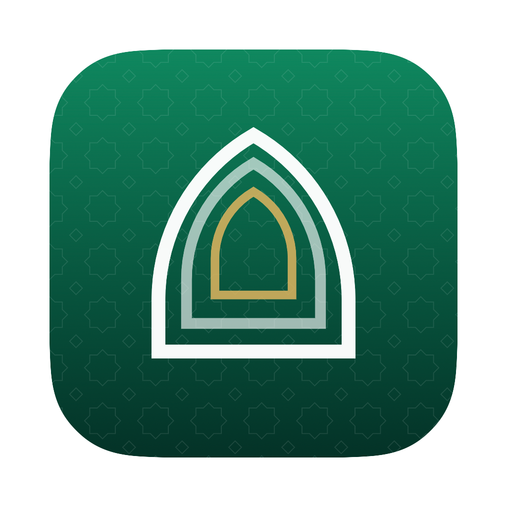

<div align="center">



# Sajadah

**Prayer times and Quran, in your macOS menubar.**

[](LICENSE)
[](#requirements)
[](https://github.com/shaheem-pp/sajadah-macos/releases/latest)

</div>

The menubar item shows the next prayer and the time remaining — `🌙 Asr 1h 23m`. Clicking it
opens a popover with today's full timings and the verse of the day; the main window holds the
week ahead, your prayer streak, and a Quran reader.

Timings come from the [Aladhan API](https://aladhan.com/prayer-times-api), the Quran from
[alquran.cloud](https://alquran.cloud/api), and your position from CoreLocation.

<!-- SCREENSHOTS: replace these with real captures.
     Suggested: menubar popover, main window with the week, Quran reader, widget gallery. -->
<div align="center">
<em>Screenshots coming soon.</em>
</div>

## Download

**[⬇ Download the latest release](https://github.com/shaheem-pp/sajadah-macos/releases/latest)**
— open the `.dmg` and drag Sajadah to your Applications folder.

### First launch

Sajadah is **not notarized by Apple**, because notarization requires a paid Apple Developer
Program membership. macOS will refuse to open it the first time. This is expected, and it is
not a sign that anything is wrong with the download — you can verify the app's SHA-256 against
the one published on the release page.

To get past it, run this once in Terminal:

```bash
xattr -dr com.apple.quarantine /Applications/Sajadah.app
```

Alternatively: try to open the app, then go to **System Settings → Privacy & Security**, scroll
down, and click **Open Anyway**. (The old right-click → Open trick no longer works on macOS 15
and later.)

### Two known limitations of unsigned builds

Both work correctly when you build from source with your own Apple ID:

- **Launch at Login** may fail. macOS's `SMAppService` requires a full developer signature. The
  toggle in Settings reports the error rather than silently lying about its state.
- **Widgets may not load.** They read from an App Group container that macOS grants based on the
  signature. If your widgets stay blank, this is why.

If either matters to you, build from source — it takes about two minutes.

## Requirements

- **macOS 15** (Sequoia) or later to run
- **Xcode 26** or later to build

## Features

- Menubar countdown to the next prayer, updated every second (redrawn only when the text changes)
- Popover with today's six timings, the current place, and the Hijri date
- Full window with today plus the next 7 days
- Local notifications at prayer time, with per-prayer toggles and an optional "N minutes before" offset
- Two-stage check-ins that ask whether you prayed, with Yes/No buttons right on the notification
- Prayer log with daily streaks, a best-streak record, and a 30-day history grid
- Quran reader with all 114 surahs, Arabic interleaved with your choice of 17 English translations
- Full-text translation search, bookmarks, resume-where-you-left-off, and a verse of the day
- Friday reminder to read Surah Al-Kahf
- 17 calculation methods and both Asr conventions, changeable in Settings
- Works offline: timings are cached a month at a time on disk and keep displaying with an "Offline" badge if a refresh fails
- Refreshes on wake, on day rollover, on clock changes, and when you move more than 5 km
- Optional launch at login

## Widgets

Sajadah ships a WidgetKit extension. Add widgets from Notification Centre → Edit Widgets.

| Widget | Sizes | Shows |
|---|---|---|
| Next prayer | Small, Medium | The next prayer, its time, and the countdown, over that hour's sky gradient |
| Today | Medium, Large | All six timings with the next one marked, plus your streak |
| Verse of the day | Medium, Large | The day's ayah in Arabic with its translation |

Widgets read the same on-disk cache the app writes, so they keep working offline and cost no
extra network requests. Tapping one deep-links into the app via a `sajadah://` URL.

## Building from source

```bash
git clone https://github.com/shaheem-pp/sajadah-macos.git
cd sajadah-macos
open Sajadah.xcodeproj
```

**Set your own signing team before building** — both targets are configured against the
author's. Select the **Sajadah** target → **Signing & Capabilities** → **Team**, then do the
same for **SajadahWidgets**. Nothing else needs editing; the App Group is written as
`$(TeamIdentifierPrefix)dev.shaheem.Sajadah` and picks up your team automatically.

Then ⌘R. On first launch the app asks for location and notification permission.

If `xcodebuild` fails with a Command Line Tools error, point `DEVELOPER_DIR` at Xcode:

```bash
DEVELOPER_DIR=/Applications/Xcode.app/Contents/Developer xcodebuild -scheme Sajadah build
```

Location does not work reliably in SwiftUI Previews under the sandbox — run the app normally.

### Releasing

Pushing to `main` publishes nothing. Releases are cut by pushing a tag:

```bash
git tag v1.0.0 && git push origin v1.0.0
```

That triggers [`.github/workflows/release.yml`](.github/workflows/release.yml), which builds the
app, packages the DMG, and publishes a GitHub Release with install instructions, the SHA-256,
and an auto-generated changelog. It needs **no secrets** — the build is ad-hoc signed, so there
is no certificate to store.

To build a DMG locally without releasing anything:

```bash
./scripts/release.sh 1.0.0
```

Both paths run the same script and produce the same artifact.

## Architecture

Both targets use Xcode's file-system-synchronized groups: **the folder structure on disk _is_
the project structure**, so adding or moving a Swift file needs no `.xcodeproj` change.

```
Shared/            Compiled into BOTH the app and the widget extension
  Models/          Prayer, PrayerLog, Quran — plain value types
  Design/          Theme (colours, metrics) and IslamicOrnaments (shapes)
  Storage/         App Group file locations and the on-disk cache
  Fonts/           Amiri Quran + the code that registers it
Sajadah/
  App/             Entry point, AppCoordinator, navigation
  Services/        Network clients, CoreLocation, notifications, the ticker
  Stores/          Observable state: timings, prayer log, Quran, settings
  Features/        One folder per surface — MenuBar, Prayer, Quran, Settings
  UI/              Shared views and formatting used across features
SajadahWidgets/    WidgetKit extension
```

## How it works

`AppCoordinator` owns the long-lived objects and wires them together, so the connections hold
whether or not any view is on screen:

- **`LocationManager`** publishes a `State` enum (`loading` / `home` / `needPermission` / `denied` / `error`) and hands fresh coordinates to the store through a callback.
- **`AladhanAPI`** fetches one calendar month per request from `/v1/calendar/{year}/{month}` with `iso8601=true`, so every timing arrives as a fully-offset instant and DST needs no special handling.
- **`PrayerTimesStore`** caches months to the App Group container, always keeps at least 8 days of timings ahead of today, and answers "what's next?" by searching a flat sorted list of events — which is what makes the countdown cross midnight correctly.
- **`Ticker`** advances the clock once a second via an async loop rather than a run-loop timer, so it keeps ticking while the popover is open.
- **`NotificationScheduler`** rewrites the whole pending batch whenever timings, preferences or the prayer log change. Rather than rationing each kind of notification separately, it builds every candidate, sorts by fire date and keeps the nearest 60 — so the 64-request budget always goes to whatever happens soonest.
- **`PrayerLogStore`** records what was prayed in its own file, deliberately separate from the timings cache: it is the user's own data and must survive a location change, a method change or a cache wipe.

### Quran

The main window is a `NavigationSplitView`: prayer times and the Quran share one window. The
location permission flow lives inside the prayer pane only, so a denied location never blocks
reading.

**`QuranAPI`** fetches Arabic and translation in a single request per surah
(`/v1/surah/{n}/editions/quran-uthmani,{translation}`) and normalises the text before anything
else sees it. Two quirks in that feed make the normalisation load-bearing:

- The Uthmani edition **prepends the Basmala** to ayah 1 of every surah except 1 and 9, while translations do not. Left alone, the Arabic and the translation drift apart from the first verse. It is stripped and re-rendered as a header. Surah 1 keeps it, because there it genuinely *is* ayah 1; surah 9 never had one. Surah 1 also arrives with a stray U+FEFF.
- `sajda` is `false` on ordinary verses but an **object** on prostration verses, so decoding it as a `Bool` throws partway through Surah As-Sajda.

Surahs are cached as they are read — 72 KB for Al-Kahf, 240 KB for the longest surah — and the
cache is keyed by translation edition, so switching translation invalidates it. Bookmarks and
reading position live in their own file, separate from that cache.

**The Arabic font is bundled.** macOS's own Arabic faces are UI fonts, and asking them to
typeset Uthmani script goes visibly wrong: waqf marks float away from the word, the small high
rounded zero degrades to a sukun, the small low meem is dropped, and the ayah marker leaves its
numeral outside the rosette instead of nested inside it. Mishafi, despite the name, is
optically tiny and collides its diacritics; Waseem mangles the shaping outright.

So the app ships **Amiri Quran** — purpose-built for Quranic typesetting, 137 KB, under the SIL
Open Font License 1.1, which permits redistribution. It is registered into the process at launch
via `CTFontManagerRegisterFontsForURL`, so nothing is installed into the user's Font Book. The
system faces stay in the picker as a matter of taste, filtered to whatever actually resolves so
the picker can never offer a font that would silently fall back. Settings shows a live preview,
because the faces differ enormously at identical point sizes.

The font and its licence live in [`Shared/Fonts/`](Shared/Fonts/).

### Check-ins

Each prayer is asked about as its own window closes. A prayer's window runs until the next one
begins; Isha has no following prayer, so it runs to a cutoff time you set (default 11pm).

| Prayer | Window closes at |
|---|---|
| Fajr | Sunrise |
| Dhuhr | Asr |
| Asr | Maghrib |
| Maghrib | Isha |
| Isha | Your evening cutoff |

The ask escalates in two stages. Ten minutes before the window closes you get a soft "Did you
pray Asr?" — answering **Yes** logs it, **Not yet** records nothing. If it is still unlogged
when the window actually closes, the question comes back as a final ask, and **No** there marks
it missed. Answering at either stage retires the other, because the batch is rebuilt from
scratch and skips anything already answered.

Anything you miss can still be logged by clicking the circle beside a prayer in the popover.

### Design

Two colours carry the identity — a deep jade and a warm brass, both long-standing in Islamic
art — kept desaturated so they read as a wash over macOS's own materials rather than as chrome
painted on top. Each prayer also carries the light of its hour: low-chroma gradients that tell
dawn from dusk at a glance without fighting the text on them.

The ornament in [`Shared/Design/IslamicOrnaments.swift`](Shared/Design/IslamicOrnaments.swift)
is drawn from geometry rather than traced. The **Rub el Hizb** — the eight-pointed star that
marks each eighth of the Quran — is the union of two squares at 45°, so its inner radius is not
a free parameter: the crossing point sits at `cos(45°) / cos(22.5°)` ≈ 0.765 of the outer
radius, and any other value stops being a khatim. The **mihrab arch** is built the way a real
one is, from two circular arcs each centred on the *opposite* springing point, so they meet at
an angle and leave a genuine point at the apex; joining them tangentially instead just produces
a rounded rectangle.

The app icon is generated from that same `MihrabArch` shape rather than drawn by hand, so it
can't drift from the UI:

```bash
./scripts/make-icon.sh
```

## Privacy

No account, no analytics, no telemetry. Your coordinates go to `api.aladhan.com` to compute
timings — that is the only personal data that leaves your Mac, and it goes to no one else.
Everything you generate (prayer log, streaks, bookmarks, reading position) stays local.

Full detail in [PRIVACY.md](PRIVACY.md).

## Roadmap

- Qibla direction (bearing + compass)
- Manual city override for when location is unavailable
- Adhan audio at prayer time

## Contributing

Issues and pull requests are welcome — see [CONTRIBUTING.md](CONTRIBUTING.md) for the build
setup and a tour of the layout.

## Licence

Sajadah is [MIT licensed](LICENSE).

The bundled **Amiri Quran** font is © 2010–2022 The Amiri Project Authors and is used under the
SIL Open Font License 1.1. Full attributions in [THIRD-PARTY-NOTICES.md](THIRD-PARTY-NOTICES.md).

## Support

Sajadah is free and always will be. If it's useful to you, a coffee is very welcome.

<!-- TODO: claim a handle at buymeacoffee.com, then replace YOUR-HANDLE below and
     uncomment the matching line in .github/FUNDING.yml -->
<!--
<a href="https://www.buymeacoffee.com/YOUR-HANDLE">
  
</a>
-->
