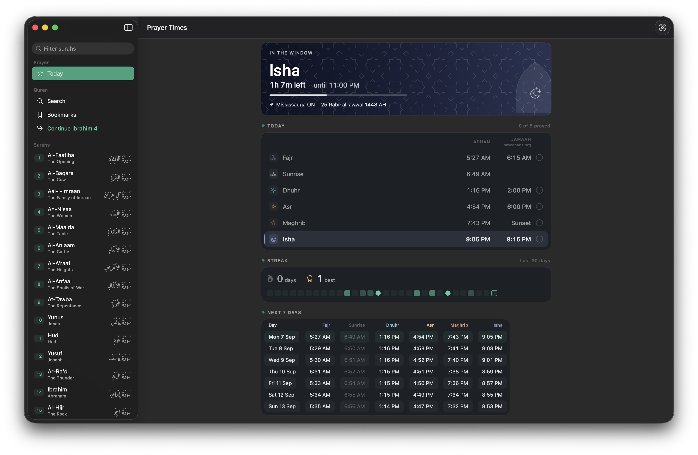
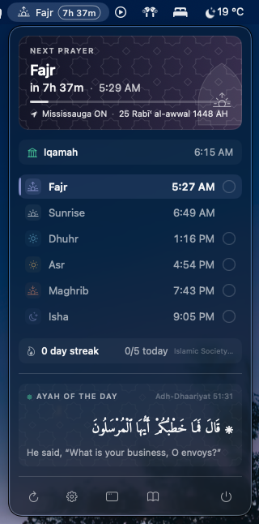
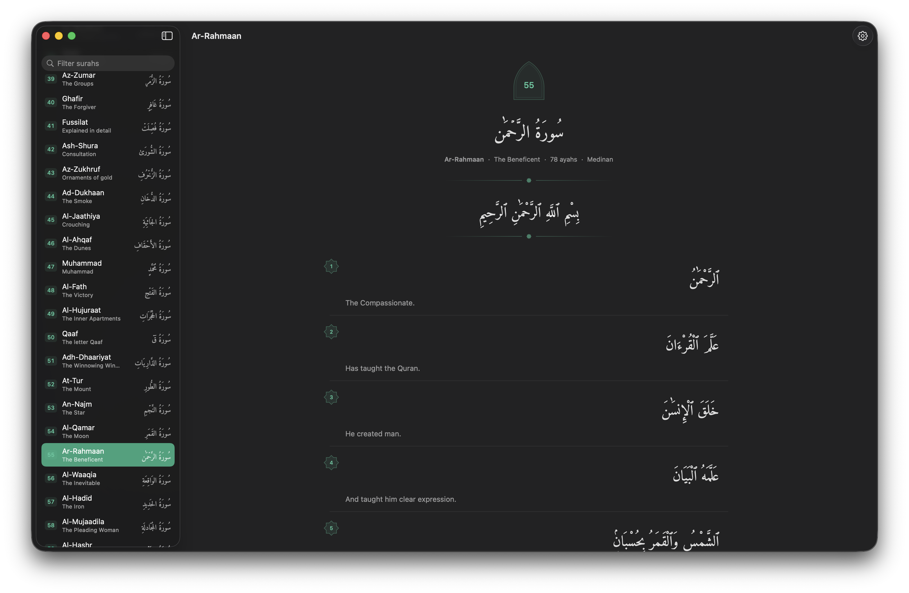

<div align="center">


# Sajadah

**Prayer times and Quran, in your macOS menubar.**

[](LICENSE)
[](#requirements)
[](https://github.com/shaheem-pp/sajadah-macos/releases/latest)

</div>

Sajadah sits in your menubar and shows the next prayer and how long until it — `🌙 Asr 1h 23m`.
Click it for today's times, your masjid's jamaah time, and the verse of the day. Open the
window for the week ahead, your prayer streak, upcoming fasting days, and a Quran reader.

Prayer times come from [Aladhan](https://aladhan.com/prayer-times-api), the Quran from
[alquran.cloud](https://alquran.cloud/api). It works offline once it has loaded, and sends
nothing about you anywhere.

<div align="center">



<em>The window — today's times beside your masjid's jamaah times, your streak, and the week ahead.</em>

</div>

<table>
<tr>
<td width="34%" valign="top" align="center">

</td>
<td width="66%" valign="top" align="center">

</td>
</tr>
<tr>
<td align="center"><em>The popover.</em></td>
<td align="center"><em>The reader.</em></td>
</tr>
</table>

## Install

Paste this into Terminal. It downloads the latest release, puts it in Applications, and opens it:

```bash
curl -fsSL https://github.com/shaheem-pp/sajadah-macos/releases/latest/download/Sajadah.dmg -o /tmp/Sajadah.dmg &&
hdiutil attach -quiet /tmp/Sajadah.dmg &&
cp -R /Volumes/Sajadah/Sajadah.app /Applications/ &&
hdiutil detach -quiet /Volumes/Sajadah &&
rm /tmp/Sajadah.dmg &&
open /Applications/Sajadah.app
```

On first launch it asks for your location and for permission to send notifications.

**Prefer the DMG?** Download it from the
[latest release](https://github.com/shaheem-pp/sajadah-macos/releases/latest), drag Sajadah
into Applications, then run this once so macOS lets it open:

```bash
xattr -dr com.apple.quarantine /Applications/Sajadah.app
```

If macOS says *"Sajadah" Not Opened — Apple could not verify…*, click **Done** (not *Move to
Trash*), run the command above, and open it again. Sajadah isn't notarized because that needs
a paid Apple developer account; the source and the build script are public if you want to
check what you're running.

### Updating

Sajadah checks for a new release once a day and says so in the popover. Settings → General has a
**Copy Update Command** button; or paste this:

```bash
killall Sajadah 2>/dev/null;
curl -fsSL https://github.com/shaheem-pp/sajadah-macos/releases/latest/download/Sajadah.dmg -o /tmp/Sajadah.dmg &&
hdiutil attach -quiet /tmp/Sajadah.dmg &&
rm -rf /Applications/Sajadah.app &&
cp -R /Volumes/Sajadah/Sajadah.app /Applications/ &&
hdiutil detach -quiet /Volumes/Sajadah &&
rm /tmp/Sajadah.dmg &&
open /Applications/Sajadah.app
```

Your prayer log, streak, bookmarks and settings are kept.

### Requirements

- macOS 15 (Sequoia) or later
- Xcode 26 or later, only if you build it yourself

## What it does

**Prayer times**
- Menubar countdown to the next prayer, or to your masjid's jamaah once the adhan has passed
- Today's six times in the popover and the window, with the next one marked
- The next 7 days, and the Hijri date — which turns over at Maghrib, or at midnight if you prefer
- The calculation method picked for your location, or any of 17 to choose yourself; both Asr conventions; and per-prayer minute adjustments for when your local calendar runs a few minutes off
- Notifications at each prayer, optionally some minutes before, and a reminder before jamaah

**Your masjid**
- Jamaah times read from your masjid's own website, or set as "N minutes after adhan"
- Shown beside the adhan in the menubar, the popover, the window, and a widget

**Prayer log**
- A tap on each prayer to log it, or answer the notification that asks whether you prayed
- Daily streak, best streak, and a five-week calendar — click any day to fill it in

**Fasting**
- Mondays, Thursdays, the white days, Ashura and Arafah, each its own switch, off by default
- Marked on the prayer panel, with a reminder the evening before so you can plan suhoor
- In Ramadan: the day of the month with suhoor and iftar times, and iftar beside the date

**Quran**
- All 114 surahs, Arabic with your choice of 17 English translations
- Search the translations, bookmark ayahs, pick up where you left off
- A verse of the day, a Friday reminder to read Al-Kahf, and an optional daily reading reminder

**And**
- Works offline — times are cached a month at a time, and a badge says when they're stale
- No Dock icon unless a window is open; optional launch at login
- ⌘Q closes the window and leaves Sajadah in the menubar; quit from the popover, or with ⌥⌘Q
- The surah list stays out of the way on the prayer page and appears when you open the Quran
- No account, no analytics

## Widgets

Add them from Notification Centre → Edit Widgets. They work offline, from the same data the app uses.

| Widget | Sizes | Shows |
|---|---|---|
| Next Prayer | Small, Medium | A live countdown to the next prayer, the jamaah, or the end of the window — the same as the menubar. Medium adds the day's five prayers on a timeline |
| Today | Medium, Large | Every prayer with its Adhan and Iqamah, the next one marked, and the Hijri date. Large adds sunrise, Jummah and the fasting line |
| Prayer Log | Small, Medium | Today's prayers as a ring, and your streak. Medium has a button for each prayer — click to log it without opening the app |
| Masjid | Small, Medium | The next jamaah, or the full posted table with Jummah |
| Hijri Date | Small | Today's Islamic date, fasting days, and in Ramadan a countdown to iftar |
| Ayah of the Day | Medium, Large | The day's verse with its translation; click to open the surah |

## Settings

- **General** — calculation method, Asr convention, 24-hour clock, launch at login, updates
- **Notifications** — which prayers, how many minutes before, jamaah reminders, and the "did you pray?" check-ins
- **Fasting** — which fasting days to mark, when the reminder comes, and a ±2 day Hijri adjustment for when your community started the month on a different night
- **Quran** — translation, Arabic font and sizes, reading reminders
- **Location** — where you are, and a button to refetch
- **Masjid** — your masjid's website, or minutes-after-adhan offsets
- **Advanced** — adjust each adhan time by the minute; off by default

## Privacy

Your coordinates go to `api.aladhan.com` to calculate prayer times. That is the only thing about
you that leaves your Mac. Surah text comes from `api.alquran.cloud`, jamaah times from your
masjid's own page, and once a day the app asks GitHub whether there's a new release — you can
turn that off. Everything you create (log, streak, bookmarks) stays on your Mac.

Details in [PRIVACY.md](PRIVACY.md).

## Building from source

```bash
git clone https://github.com/shaheem-pp/sajadah-macos.git
cd sajadah-macos
open Sajadah.xcodeproj
```

Set your own signing team on both targets (Sajadah and SajadahWidgets), then ⌘R. That's the
only change needed; [CONTRIBUTING.md](CONTRIBUTING.md) has the details and a tour of the
folders. The reasoning behind the less obvious parts — the masjid scraper, the Quran text
fixes, why widgets work on unsigned builds — is in [docs/how-it-works.md](docs/how-it-works.md).

## Roadmap

- Qibla direction
- Set a city by hand when location is unavailable
- Adhan audio at prayer time
- Read masjid pages that render their schedule with JavaScript

Bigger questions — the App Store, push, donations — are worked through in [docs/ideas.md](docs/ideas.md).

## Contributing

Issues and pull requests are welcome — see [CONTRIBUTING.md](CONTRIBUTING.md).

## Licence

[MIT](LICENSE). The bundled **Amiri Quran** font is © 2010–2022 The Amiri Project Authors,
under the SIL Open Font License 1.1 — see [THIRD-PARTY-NOTICES.md](THIRD-PARTY-NOTICES.md).

## Support

Sajadah is free and always will be. If it's useful to you, a coffee is very welcome.

<!-- TODO: claim a handle at buymeacoffee.com, then replace YOUR-HANDLE below and
     uncomment the matching line in .github/FUNDING.yml -->
<!--
<a href="https://www.buymeacoffee.com/YOUR-HANDLE">
  
</a>
-->
